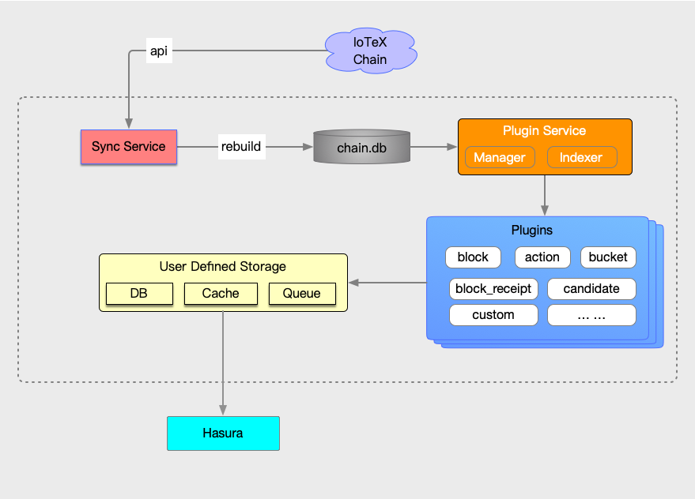

# Overview

Proofread version: IoTeX Analyzer is a project developed by the IoTeX team to enable asynchronous analysis of IoTeX blockchain data. It allows for indexing the data on the IoTeX blockchain and storing it in a database of your choice among MySQL, PostgreSQL, or SQLite3. Additionally, any other storage can be supported by writing a plugin.



## Feature
With iotex-analyser, you can deploy your plugins without any downtime and dynamically load and unload them. The plugins directory includes several basic functions, and you can write your own plugins to customize and enhance the desired functionality.

## Running using Docker Compose
```
docker-compose up
```

## Building from source

### Build

Clone this repository and build the service including plugins with:
```
git clone https://github.com/iotexproject/iotex-analyser.git
cd iotex-analyser
make
``` 

Or build the service only with:
```
make build
```

### Run

You need to create the database before you start server. Below, we use docker to run a Postgres database service:

```
docker run --name postgres12 -e POSTGRES_PASSWORD=admin --publish 5432:5432 -d postgres:12-alpine

```

Below we show a simple `config.yml`for the IoTeX Analyser service:
```yml
server:
  #loaded default plugin list
  plugins:
    - block.so
#database config
database:
  driver: postgres
  host: 127.0.0.1
  port: 5432
  user: postgres
  password: admin
  name: test
iotex:
  chainEndPoint: api.testnet.iotex.one:80
blockDB:
  dbPath: chain.db
log:
  zap:
    level: info
```
where:ì for `chain.db` we can use the snapshot with index data:
   - mainnet: https://t.iotex.me/mainnet-data-with-idx-latest
   - testnet: https://t.iotex.me/testnet-data-with-idx-latest
   
### Commands

Start IoTeX Analyser with:
```sh
./iotex-analyser -c config.yml server
```
Dynamically load a plugin with:
```sh
./iotex-analyser -c config.yml plugin load simple.so
```
Dynamically unload a plugin with:
```sh
./iotex-analyser -c config.yml plugin unload simple.so
```
List running plugins with:
```sh
./iotex-analyser -c config.yml plugin info
```

## GraphQL Support 

[Hasura](https://hasura.io/) is a GraphQL Engine, a tool that places a GraphQL API in front of a PostgreSQL Database.

Hasura Console: `https://iotexscout.io/hasura/console`

GraphQL Endpoint: `https://iotexscout.io/hasura/v1/graphql`

## plugin lists
  - [block](plugins/block/)
  - [block_action](plugins/block_action/)
  - [candidate](plugins/candidate/)
  - [staking_action](plugins/staking_action/)
  - [probation](plugins/probation/)
  
## Creating plugins
Any plugin is required to be implemented according to the following adapter interface:
```go
type Adapter interface {
	Name() string
	Version() string
	Type() Type
	Start(context.Context) error
	Stop(context.Context) error
	PutBlock(context.Context, *block.Block) error
}
```

The following code (included in `simple/simple.go`) demonstrates how to write a simple plugin:
```go
package main

import (
	"context"

  "github.com/iotexproject/iotex-analyser/db"
	"github.com/iotexproject/iotex-analyser/plugin"
	"github.com/iotexproject/iotex-core/blockchain/block"
)

type simplePlugin struct {
}

func (b simplePlugin) Name() string {
	return "simple"
}

func (b simplePlugin) Type() plugin.Type {
	return plugin.TypeStandard
}

func (b simplePlugin) Start(ctx context.Context) error {
	return nil
}

func (b simplePlugin) PutBlock(ctx context.Context, blk *block.Block) error {
  fmt.Printf("block height: %d\n", blk.Height())
  // sync update indexer height
  return db.UpdateIndexHeight(b.Name(), blk.Height())
}

func (b simplePlugin) Stop(ctx context.Context) error {
	return nil
}

func (b simplePlugin) Version() string {
	return "0.0.1"
}

// exported
var Plugin = simplePlugin{}

```
### Build your plugin
```sh
make plugin name=simple
```
This  will generates a file of `simple.so` in the current directory, and then load and run the plugin with the following command.
```
./iotex-analyser -c config.yml plugin load simple.so
```
After successfully running the plugin, the server will output something like:
```
block height: 1
...
block height: 3
```

## License
This project is licensed under the [Apache License 2.0](LICENSE).
