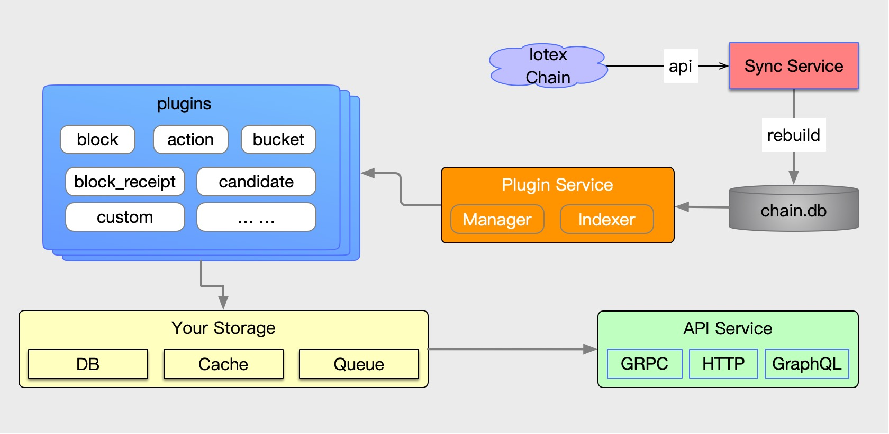

[](https://travis-ci.org/iotexproject/iotex-analyser)

# Overview

iotex-analyser is a project developed by Golang for asynchronous analysis of iotex blockchain data. 

It has the function of synchronous iotex blockchain block data.

You can analyze the data on the chain and store it in the database (MySQL, PostgreSQL, SQLite3) or other external storage by writing a plugin.



## Feature
iotex-analyser enables you to deploy your plugins without any downtime，Dynamic load/unload plugins. 
The plugins directory has realized several basic functions. 
You can also write your own plugins to complete the functions you want.

## Documentation
### build from code

Download and build the code
```
git clone https://github.com/iotexproject/iotex-analyser.git
cd iotex-analyser
make build
``` 
Build the project for general purpose (server, plugins) by
```
make
```

### Usage

You needs to create database before start server, use docker here

```
docker run --name postgres12 -e POSTGRES_PASSWORD=admin --publish 5432:5432 -d postgres:12-alpine

```

simple config.yml
```yml
server:
  #loaded default plugin list
  plugins:
    - block.so
#database config
database:
  driver: postgres
  host: 127.0.0.1
  port: 5432
  user: postgres
  password: admin
  name: test
iotex:
  chainEndPoint: api.testnet.iotex.one:80
blockDB:
  dbPath: chain.db
log:
  zap:
    level: info
```
- `chain.db` we can use the snapshot with index data:
   1. https://t.iotex.me/mainnet-data-with-idx-latest
   2. https://t.iotex.me/testnet-data-with-idx-latest
   
start server
```sh
./iotex-analyser -c config.yml server
```
dynamic load a plugin
```sh
./iotex-analyser -c config.yml plugin load simple.so
```
dynamic unload a plugin
```sh
./iotex-analyser -c config.yml plugin unload simple.so
```
display plugin running infomation
```sh
./iotex-analyser -c config.yml plugin info
```

### plugin lists
  - [block](plugins/block/)


## How to writing a plugin
Currently, a adapter interface is defined, and the written plugin needs to implement the interface.
```go
type Adapter interface {
	Name() string
	Version() string
	Type() Type
	Start(context.Context) error
	Stop(context.Context) error
	PutBlock(context.Context, *block.Block) error
}
```

The following code `simple/simple.go` demonstrates how to write a plugin
```go
package main

import (
	"context"

  "github.com/iotexproject/iotex-analyser/db"
	"github.com/iotexproject/iotex-analyser/plugin"
	"github.com/iotexproject/iotex-core/blockchain/block"
)

type simplePlugin struct {
}

func (b simplePlugin) Name() string {
	return "simple"
}

func (b simplePlugin) Type() plugin.Type {
	return plugin.TypeStandard
}

func (b simplePlugin) Start(ctx context.Context) error {
	return nil
}

func (b simplePlugin) PutBlock(ctx context.Context, blk *block.Block) error {
  fmt.Printf("block height: %d\n", blk.Height())
  // sync update indexer height
  return db.UpdateIndexHeight(b.Name(), blk.Height())
}

func (b simplePlugin) Stop(ctx context.Context) error {
	return nil
}

func (b simplePlugin) Version() string {
	return "0.0.1"
}

// exported
var Plugin = simplePlugin{}

```
### build plugin
```sh
make plugin name=simple
```
This  will generates a file of `simple.so` in the current directory, and then load and run the plugin with the following command.
```
./iotex-analyser -c config.yml plugin load simple.so
```
After successfully running the plugin, the server will output similar text
```
block height: 1
...
block height: 3
```

## License
This project is licensed under the [Apache License 2.0](LICENSE).